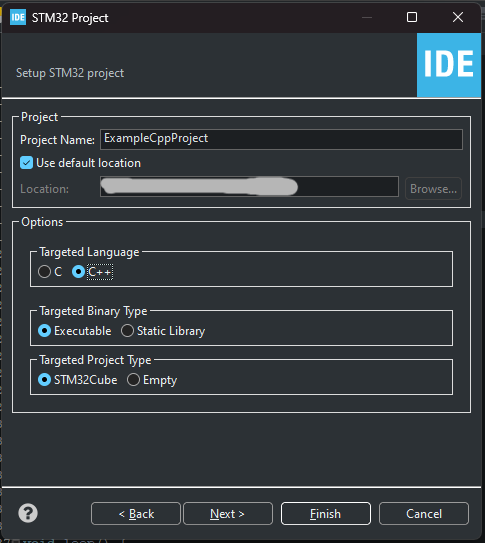
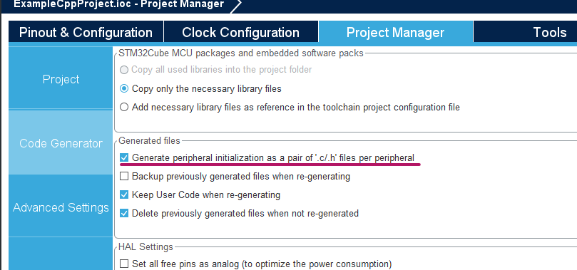

# Приклад створення та конфігурування C++ проекту для STM32

1. Створюємо чистий проект за допомогою STM32CubeIDE, вибираємо MCU/MPU або Board, натискаємо `Next`
2. Називаємо проект та вибираємо `C++` в розділі **Target Language**. Натискаємо `Finish`
   


3. В розділі **Project Manager** -> **Code Generator** вибираємо чекбокс `Generate peripheral initialization as a pair of '.c/.h' files per peripheral`. Після цього вся переферія проекту буде ініціалізована в окремих файлах, а не в `main.c`



4. Налаштовуємо **Clock Configuration** та **Pinout & Configuration**, генеруємо код після налаштування
5. Створюємо альтернативний main файл. В *Core/Inc* додаємо файл *altMain.hpp*. В *Core/Src* додаємо файл *altMain.cpp*.

6. В *altMain.hpp* вставляємо наступний код:
   
```cpp
#ifndef INC_ALTMAIN_HPP_
#define INC_ALTMAIN_HPP_


#ifdef __cplusplus
extern "C"
{
#endif
// START C-BLOCK IN C++ CODE

/* Includes ------------------------------------------------------------------*/
#include "usart.h"
// YOUR INCLUDES


/* Functions -----------------------------------------------------------------*/
void setup();
void loop();
// YOUR FUNCTIONS


// END C-BLOCK IN C++ CODE
#ifdef __cplusplus
}
#endif


#endif /* INC_ALTMAIN_HPP_ */
```

В **YOUR INCLUDES** підключаємо потрібні нам файли, але тільки `C` файли.  `C++` файли підключаємо в *altMain.cpp*.

В **YOUR FUNCTIONS** прописуємо заголовки потрібних функцій. 
Я використовую функції `setup()` та `loop()` для написання основного коду.

7. В *altMain.cpp* прописуємо наступний код:

```cpp
#include "altMain.hpp"
#include "main.h"

void setup() {
	// YOUR SETUP CODE
}

void loop() {
    // YOUR LOOP CODE
}
```

**YOUR SETUP CODE** - код, який буде виконуватись один раз перед вічним циклом. Сюди вставляємо конфігурування інтерфейсів, DMA і т.п.

**YOUR LOOP CODE** - основний код нашої програми.

8. В файлі *main.c* підключємо *altMain.hpp* та прописуємо виклики функцій `setup()` та `loop()`:

```cpp
// ...
/* Private includes ----------------------------------------------------------*/
/* USER CODE BEGIN Includes */
#include "altMain.hpp"
/* USER CODE END Includes */
// ...
int main(void)
{
    // ... 
    /* USER CODE BEGIN 2 */
	setup();
    /* USER CODE END 2 */
    
    /* Infinite loop */
    /* USER CODE BEGIN WHILE */
	while (1) {
		loop();
        /* USER CODE END WHILE */

        /* USER CODE BEGIN 3 */
	}
  /* USER CODE END 3 */
}
// ...
```

### Бонус: використання класів C++ в проекті

9. Якщо вам потрібно створити об'єкт класу та використати його в *altMain*, створюємо файли *.hpp* та *.cpp* та описуємо класи:

*classExample.hpp*
```cpp
#ifndef INC_CLASSEXAMPLE_HPP_
#define INC_CLASSEXAMPLE_HPP_

class classExample {
public:
	classExample();
	virtual ~classExample();
};

#endif /* INC_CLASSEXAMPLE_HPP_ */

```

*classExample.cpp*
```cpp
#include <classExample.hpp>

classExample::classExample() {
	// TODO Auto-generated constructor stub

}

classExample::~classExample() {
	// TODO Auto-generated destructor stub
}

```

10. В файлі *altMain.cpp* підключаємо *classExample.hpp* та створюємо об'єкт класу:
    
```cpp
#include "altMain.hpp"
#include "main.h"
#include "classExample.hpp"

classExample objectExample;

void setup() {
	// YOUR SETUP CODE
}

void loop() {
    // YOUR LOOP CODE
}
```

### Увага!

Не підключайте *.hpp* файли в *altMain.hpp*, як от наприклад заголовковий файл нашого класу, так як проект перестане білдитись та ви отримаєте помилки 

```cpp
expected '=', ',', ';', 'asm' or '__attribute__' before '{' token	classExample.hpp	/ExampleCppProject/Core/Inc	line 11	C/C++ Problem
``` 
а також 

```cpp
unknown type name 'class'	classExample.hpp	/ExampleCppProject/Core/Inc	line 11	C/C++ Problem
```

**А далі насолоджуємось програмуванням на C++ для STM32!**